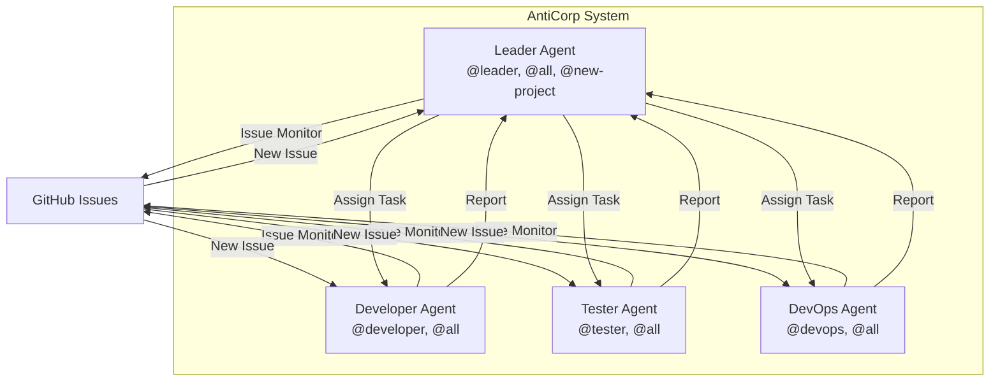

# AntiCorp

**4대의 Antigravity 클라이언트가 협업하는 자동화 회사 시스템**

## 개요

AntiCorp는 4대의 Antigravity AI 에이전트가 GitHub Issue를 통해 소통하며 프로젝트를 수행하는 자동화 시스템입니다. 각 에이전트는 독립된 역할(Leader, Developer, Tester, DevOps)을 가지고, GitHub Issue label을 활용하여 작업을 주고받습니다.

## 시스템 구조



## 4대 에이전트 역할

| Agent | 역할 | 모니터링 Label | 책임 |
|-------|------|---------------|-----|
| **Leader** | 프로젝트 총괄 | `@leader`, `@all`, `@new-project` | 새 프로젝트 수주, 작업 분배, 진행 관리 |
| **Developer** | 개발 | `@developer`, `@all` | 코드 구현, 파일 생성/수정 |
| **Tester** | 테스트 | `@tester`, `@all` | 테스트 작성, 품질 검증 |
| **DevOps** | 인프라 | `@devops`, `@all` | 프로젝트 설정, 빌드, 배포 |

## 주요 기능

### 1. GitHub Issue 기반 커뮤니케이션
- Agent 간 소통은 GitHub Issue + Label 시스템 사용
- C# 모니터링 프로그램이 Issue를 폴링하여 stdout 출력
- Antigravity가 출력을 기다렸다가 처리

### 2. Profile 분리
- 각 Agent는 독립된 Antigravity profile 사용
- 서로 다른 Google 계정으로 로그인 가능
- Global rules와 workflow를 profile 레벨에서 정의

### 3. 자동 프로젝트 생성
- `@new-project` label로 새 프로젝트 수주
- Leader가 자동으로 git repository 생성
- Workspace에 폴더 추가 (기존 workspace 유지)

## 디렉토리 구조

```
AntiCorp/
├── Profiles/                    # Agent별 Profile 설정
│   ├── Leader/
│   │   ├── global.rules.md      # Leader 역할 정의
│   │   └── workflows/
│   │       ├── monitor-issues.md
│   │       └── create-project.md
│   ├── Developer/
│   │   ├── global.rules.md
│   │   └── workflows/
│   ├── Tester/
│   │   ├── global.rules.md
│   │   └── workflows/
│   └── DevOps/
│       ├── global.rules.md
│       └── workflows/
├── Tools/                       # 공통 도구
│   ├── IssueMonitor/           # GitHub Issue 모니터링 C# 프로그램
│   ├── WindowAutomation/       # 윈도우 자동화 C# 도구
│   └── Scripts/                # PowerShell 스크립트
│       ├── Create-Issue.ps1
│       └── Start-Agent.ps1
└── Projects/                    # 수주한 프로젝트들 (동적 추가)
```

## 빠른 시작

### 1. 필수 요구사항
- Windows 10/11
- .NET 8.0 SDK
- PowerShell 5.1 이상
- GitHub CLI (`gh`)
- Antigravity

### 2. 도구 빌드

```powershell
# IssueMonitor 빌드
cd Tools\IssueMonitor
dotnet build --configuration Release

# WindowAutomation 빌드
cd ..\WindowAutomation
dotnet build --configuration Release
```

### 3. GitHub 인증

```powershell
# GitHub CLI 로그인
gh auth login

# Personal Access Token 생성 및 환경 변수 설정
$env:GITHUB_TOKEN = "ghp_your_token_here"
```

### 4. Agent 실행

각 Agent를 별도의 profile로 실행:

```powershell
# Leader Agent
.\Tools\Scripts\Start-Agent.ps1 -Agent Leader

# Developer Agent
.\Tools\Scripts\Start-Agent.ps1 -Agent Developer

# Tester Agent
.\Tools\Scripts\Start-Agent.ps1 -Agent Tester

# DevOps Agent
.\Tools\Scripts\Start-Agent.ps1 -Agent DevOps
```

### 5. Profile 설정

각 Antigravity 클라이언트에서:
1. 서로 다른 Google 계정으로 로그인
2. Global rules를 Profile에 복사:
   ```powershell
   # 예: Leader Agent
   Copy-Item "c:\Workspace\AntiCorp\Profiles\Leader\global.rules.md" "$env:APPDATA\Antigravity\Profiles\AntiCorp-Leader\.agent\" -Force
   Copy-Item "c:\Workspace\AntiCorp\Profiles\Leader\workflows" "$env:APPDATA\Antigravity\Profiles\AntiCorp-Leader\.agent\" -Recurse -Force
   ```

## 사용 방법

### 새 프로젝트 시작

GitHub에 `@new-project` label로 Issue 생성:

```powershell
.\Tools\Scripts\Create-Issue.ps1 `
    -Title "새 웹사이트 개발" `
    -Body "React 기반 포트폴리오 웹사이트 개발..." `
    -Labels "@new-project"
```

Leader Agent가 자동으로:
1. Issue 감지
2. 프로젝트 폴더 및 git repository 생성
3. 작업을 Developer, Tester, DevOps에게 분배

### Agent 간 소통

```powershell
# Developer에게 작업 요청
.\Tools\Scripts\Create-Issue.ps1 `
    -Title "로그인 기능 구현" `
    -Body "JWT 인증 기반 로그인..." `
    -Labels "@developer"

# 전체에게 공지
.\Tools\Scripts\Create-Issue.ps1 `
    -Title "프로젝트 마일스톤 달성" `
    -Body "1차 버전 완료..." `
    -Labels "@all"
```

## 주요 도구

### IssueMonitor
GitHub Issue를 모니터링하고 stdout으로 출력하는 C# 프로그램

```powershell
IssueMonitor.exe --repo yj7-park/AntiCorp --labels "@leader,@all" --interval 10
```

### WindowAutomation
Windows API로 윈도우 활성화 및 키 입력 자동화

```powershell
WindowAutomation.exe activate "Antigravity - Leader"
WindowAutomation.exe sendkeys "Antigravity" "^k"
```

### Create-Issue.ps1
GitHub Issue를 쉽게 생성하는 스크립트

```powershell
.\Create-Issue.ps1 -Title "제목" -Body "내용" -Labels "@agent"
```

## Workflow

각 Agent는 다음 workflow를 사용합니다:

- **monitor-issues**: Issue 모니터링 (모든 Agent 공통)
- **create-project**: 새 프로젝트 생성 (Leader 전용)
- **respond-to-issue**: Issue 응답 및 보고 (모든 Agent 공통)

Antigravity에서 workflow 실행:
```
/monitor-issues
/create-project
/respond-to-issue
```

## 라이센스

MIT License

## 기여

이슈나 풀 리퀘스트는 언제든 환영합니다!
