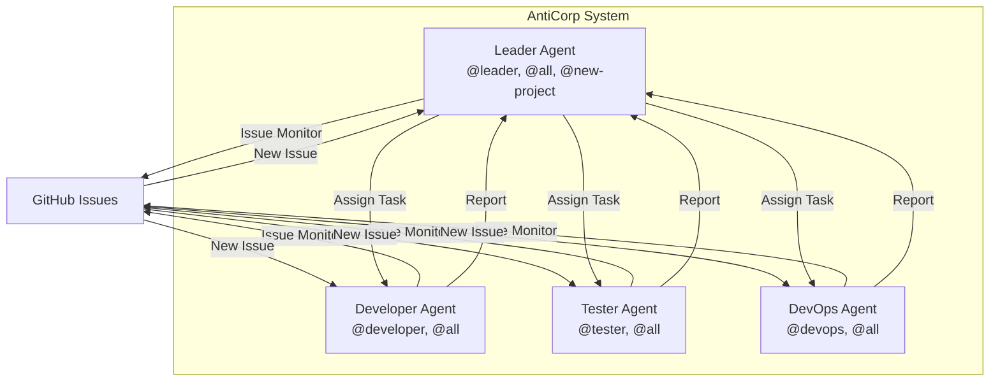

# AntiCorp

**4대의 Antigravity 클라이언트가 협업하는 자동화 회사 시스템**

## 개요

AntiCorp는 4대의 Antigravity AI 에이전트가 GitHub Issue를 통해 소통하며 프로젝트를 수행하는 자동화 시스템입니다. 각 에이전트는 독립된 역할(Leader, Developer, Tester, DevOps)을 가지고, GitHub Issue label을 활용하여 작업을 주고받습니다.

## 시스템 구조

## 4대 에이전트 역할

| Agent | 역할 | 모니터링 Label | 책임 |
|-------|------|---------------|-----|
| **Leader** | 프로젝트 총괄 | `@leader`, `@all`, `@new-project` | 새 프로젝트 수주, 작업 분배, 진행 관리 |
| **Developer** | 개발 | `@developer`, `@all` | 코드 구현, 파일 생성/수정 |
| **Tester** | 테스트 | `@tester`, `@all` | 테스트 작성, 품질 검증 |
| **DevOps** | 인프라 | `@devops`, `@all` | 프로젝트 설정, 빌드, 배포 |

## 빠른 시작

1. **GitHub CLI 로그인**: `gh auth login`

## 5단계: Agent 실행 및 테스트
1. 모든 에이전트 통합 실행: `.\Tools\Scripts\Start-All-Agents.ps1`
2. 개별 실행이 필요한 경우: `.\Tools\Scripts\Start-Agent.ps1 -Agent Leader` 등
3. Antigravity에서 `/monitor-issues` 입력하여 모니터링 시작

더 자세한 내용은 [SETUP.md](file:///c:/Workspace/AntiCorp/SETUP.md)를 참고하세요.

