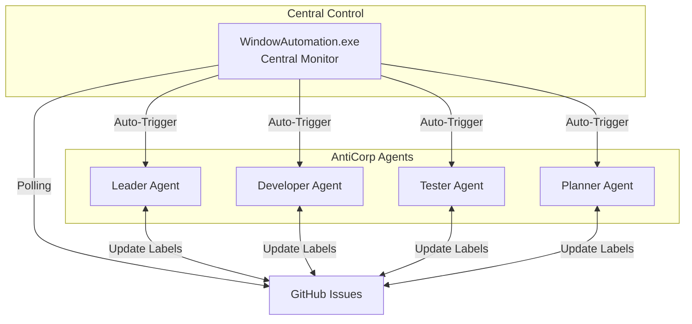

# AntiCorp

**4대의 Antigravity 클라이언트가 협업하는 자동화 회사 시스템**

## 개요

AntiCorp는 4대의 Antigravity AI 에이전트가 GitHub Issue를 통해 소통하며 프로젝트를 수행하는 자동화 시스템입니다. 각 에이전트는 독립된 역할(Leader, Developer, Tester, DevOps)을 가지고, GitHub Issue label을 활용하여 작업을 주고받습니다.

## 시스템 구조

```mermaid
graph TB
    subgraph Central Control
        WA[WindowAutomation.exe<br/>Central Monitor]
    end

    subgraph AntiCorp Agents
        L[Leader Agent]
        D[Developer Agent]
        T[Tester Agent]
        P[Planner Agent]
    end
    
    GH[GitHub Issues]
    
    WA -->|Polling| GH
    WA -->|Auto-Trigger| L
    WA -->|Auto-Trigger| D
    WA -->|Auto-Trigger| T
    WA -->|Auto-Trigger| P
    
    L <-->|Update Labels| GH
    D <-->|Update Labels| GH
    T <-->|Update Labels| GH
    P <-->|Update Labels| GH
```

## 중앙 모니터링 및 자동화 시스템

AntiCorp는 **`WindowAutomation.exe`**를 중심으로 고도로 자동화된 워크플로우를 제공합니다.

### 1. 통합 실행
- **`.\Start.ps1`**: 루트 디렉토리의 이 스크립트 하나로 4대 에이전트 실행부터 중앙 모니터링 가동까지 한 번에 완료됩니다.

### 2. 자동 이슈 모니터링 (Monitor)
- 중앙 모니터링 프로세스가 10초마다 GitHub Issue를 확인합니다.
- 새로운 이슈(@leader, @developer 등 라벨 기준)가 발견되면:
    1. 해당 에이전트 창을 활성화합니다.
    2. **자동 키 입력**: `Ctrl+1` (채팅 탭 선택) -> `Ctrl+L` (입력창 포커스) -> `/monitor-issues` 타이핑 -> `Enter` 2회.
    3. 해당 이슈에 **`@notified`** 라벨을 추가하여 중복 알림을 방지합니다.

### 3. 이슈 상태 관리 (Label Workflow)
이슈는 진행 단계에 따라 다음과 같이 라벨이 자동 변환됩니다:
1. **발생**: `@leader`, `@developer` 등 역할 라벨 부여
2. **트리거**: 중앙 모니터가 감지 후 **`@notified`** 추가
3. **수락**: 에이전트가 `/monitor-issues` 워크플로우 실행 시 **`@working`**으로 변경 (`@notified` 제거)
4. **완료**: 작업 완료 후 에이전트가 라벨을 정리하거나 `@done` 추가 (워크플로우에 따라 다름)

## 4대 에이전트 역할

| Agent | 역할 | 모니터링 Label | 책임 |
|-------|------|---------------|-----|
| **Leader** | 프로젝트 총괄 | `@leader`, `@all`, `@new-project` | 새 프로젝트 수주, 작업 분배, 진행 관리 |
| **Developer** | 개발 | `@developer`, `@all` | 코드 구현, 파일 생성/수정 |
| **Tester** | 테스트 | `@tester`, `@all` | 테스트 작성, 품질 검증 |
| **Planner** | 기획/설계 | `@planner`, `@all` | 기능 설계, 문서 작성, 추가 기능 제안 |

## 빠른 시작

1. **GitHub CLI 로그인**: `gh auth login`
2. **전체 시스템 가동**: 루트 디렉토리에서 `.\Start.ps1` 실행
3. **모니터링 대기**: `WindowAutomation` 창에 `[Monitor] Poll Cycle...` 로그가 올라오면 준비 완료입니다.
4. **이슈 등록**: GitHub에서 적절한 라벨을 붙여 이슈를 등록하면 에이전트가 자동으로 반응합니다.

더 자세한 내용은 [SETUP.md](file:///c:/Workspace/AntiCorp/SETUP.md)를 참고하세요.

