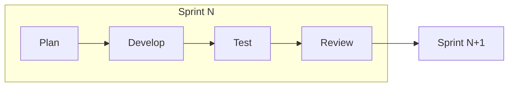
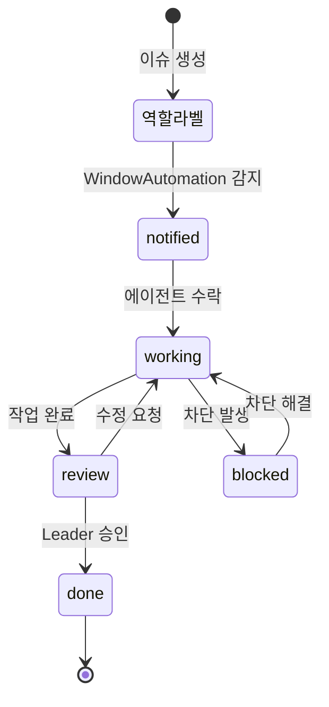

# AntiCorp Agile 협업 시나리오

## 개요

AntiCorp는 4개의 에이전트(Leader, Developer, Tester, Planner)가 **Agile 방식**으로 협업합니다.
각 프로젝트는 **10개의 Sprint**로 나누어 점진적으로 개발됩니다.

---

## Sprint 기반 개발 프로세스



### Sprint 구조 (1 Sprint = 1 사이클)

| 단계 | 주체 | 활동 | 산출물 |
|------|------|------|--------|
| **Plan** | Planner + Leader | 기능 설계, 우선순위 결정 | 설계 문서, Sprint 계획 |
| **Develop** | Developer | 기능 구현 | 코드, 커밋 |
| **Test** | Tester | 테스트 및 검증 | 테스트 결과, 버그 리포트 |
| **Review** | Leader | 결과 검토, 다음 Sprint 준비 | 승인, 피드백 |

---

## 전체 프로젝트 흐름 (10 Sprint)

```
Sprint 1: MVP 핵심 기능 (설계 50%, 구현 30%, 테스트 20%)
Sprint 2: MVP 완성 (구현 60%, 테스트 40%)
Sprint 3: 핵심 기능 보강 (설계 20%, 구현 50%, 테스트 30%)
Sprint 4-6: 추가 기능 개발 (반복)
Sprint 7-8: 안정화 및 버그 수정
Sprint 9: 최종 테스트 및 문서화
Sprint 10: 릴리즈 준비
```

---

## 역할별 Sprint 내 책임

### Leader
- Sprint 시작: 목표 설정, 이슈 발급
- Sprint 중: 진행 상황 모니터링
- Sprint 종료: 결과 검토, 다음 Sprint 계획

### Planner
- Sprint 시작: 해당 Sprint 기능 상세 설계
- Sprint 중: 설계 변경 요청 대응
- Sprint 종료: 다음 Sprint 설계 준비

### Developer
- Sprint 시작: 구현 계획 수립
- Sprint 중: 코드 구현, 테스트 요청
- Sprint 종료: 코드 정리, 문서화

### Tester
- Sprint 시작: 테스트 계획 수립
- Sprint 중: 지속적 테스트, 버그 리포트
- Sprint 종료: 테스트 결과 보고

---

## 예상 시나리오

### 시나리오 1: 새 프로젝트 시작

```
1. User → Leader: @new-project 이슈 생성
2. Leader: 프로젝트 분석, GitHub repo 생성
3. Leader → Planner: Sprint 1 설계 요청 (@planner)
4. Leader → All: 프로젝트 clone 요청 (@all)
5. Planner: MVP 설계, Wiki 문서 작성
6. Planner → Leader: 설계 완료 보고 (@review)
7. Leader: 설계 승인
8. Leader → Developer: Sprint 1 구현 요청 (@developer)
```

### 시나리오 2: 일반 Sprint 사이클

```
1. Leader → Planner: Sprint N 설계 요청
2. Planner: 설계 완료, 문서 작성
3. Leader → Developer: 구현 요청 (설계 링크 포함)
4. Developer: 코드 구현
5. Developer → Tester: 테스트 요청
6. Tester: 테스트 실행
   - 버그 발견 시 → Developer에게 버그 이슈 발급 (Sprint 내 반복)
   - 통과 시 → Leader에게 보고
7. Leader: Sprint 검토
8. Leader: Sprint N+1 시작 (또는 릴리즈)
```

### 시나리오 3: 버그 발견 시

```
1. Tester: 버그 발견
2. Tester → Developer: 버그 이슈 발급 (@developer, 버그 템플릿)
3. Developer: 버그 수정
4. Developer → Tester: 재테스트 요청
5. Tester: 검증
   - 통과 → 원래 흐름 계속
   - 미통과 → 2번으로 돌아감
```

### 시나리오 4: 설계 변경 필요 시

```
1. Developer/Tester: 설계 문제 발견
2. → Leader: @blocked 라벨로 이슈 상태 변경
3. Leader → Planner: 설계 재검토 요청
4. Planner: 설계 수정
5. Leader: 수정된 설계 승인
6. Leader: @blocked 해제, 작업 재개
```

### 시나리오 5: Sprint 완료 및 다음 Sprint 전환

```
1. Tester → Leader: Sprint N 모든 테스트 통과 보고
2. Leader: Sprint 완료 확인
3. Leader: Sprint N 이슈들 @done 처리
4. Leader → Planner: Sprint N+1 설계 요청
5. (시나리오 2 반복)
```

---

## Label 상태 전이



---

## 소통 규칙

1. **모든 소통은 AntiCorp main repo Issue를 통해**
2. **각 이슈는 명확한 템플릿을 따를 것**
3. **상태 변경 시 반드시 라벨 업데이트**
4. **완료 시 반드시 댓글로 보고**
